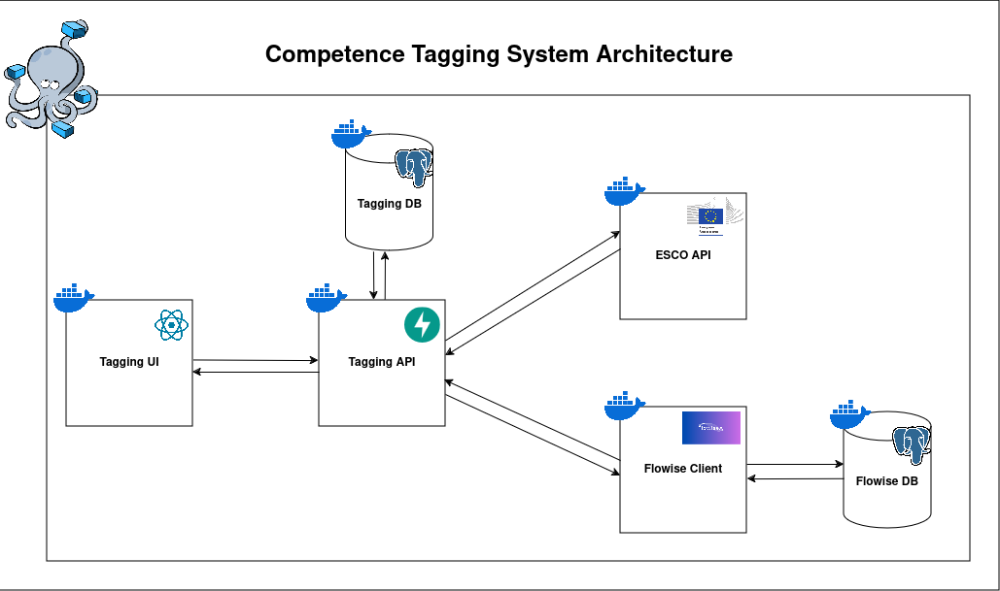

# Development of a computational system that maps courses' learning outcomes to ESCO competences

In this repository you will find the aggregated material for a dissertation about mapping the learning outcomes of University of Aveiro's courses to ESCO skills

## What is ESCO?
The acronym ESCO stands for European Skills, Competences, Qualifications and Occupations and functions as a dictionary that describes, identifies and classifies professional occupations and skills relevant to the EU labor market and the education and training sectors. 

ESCO was developed by the European Commission and provides descriptions of 3008 occupations and 13 890 skills associated with those occupations, translated into 28 languages (EU languages plus Icelandic, Norwegian, Ukrainian and Arabic).

The major objective of ESCO is to support job mobility across Europe by offering a "common language" to describe occupations and skills that can be used by different stakeholders on employment, education and lifelong learning. 
For example, if an individual completed a Bachelor’s degree in Portugal and a Master’s degree in France and, for some reason, wants to work in Germany, ESCO would help German employers to understand which skills the individual possesses and recognize their higher education degrees.

Source: https://esco.ec.europa.eu/en/about-esco/what-esco

## Objectives

The main goal of this dissertation is to develop a computational system capable of processing educational offers’ information, and map that data to ESCO skills, while taking advantage of Large Language Models (LLMs) and an API provided by ESCO for that purpose. Our case study will be based on the Pedagogical Dossiers (DPUCs) and course description of the micro-credentials implemented at the University of Aveiro (UA).

Therefore, the specific objectives of this dissertation can be summarized as follows:

* Implementation and testing of a system to manage the skills of UA’s educational offer and to match them to ESCO skills.
* Development of a pipeline that connects the ESCO framework (API), UA’s DPUCs and an LLM framework.
* Survey the State of the Art regarding occupations and skills taxonomies across the world and in national contexts.
* Study and further integrate the ESCO API in the system’s pipeline.
* To test several LLM frameworks and NLP libraries to assess their applicability in the task of mapping UA’s educational offer to ESCO skills.
* To deploy the system’s pipeline in order to automate the skills matching process.
* Evaluate the system’s performance, trusting on Course Directors’ manual verification of the skills’ matching.

The ultimate goal of this dissertation is to provide the University of Aveiro's academic community with a trustable framework that maps the institution’s educational offer to standardized and specific skills of the European occupations and skills taxonomy (ESCO). This will help current and future students to have a better understanding of the University’s educational offer and companies’ Human Resources representatives to acknowledge and recognize UA’s former students (alumnis) skills upon hiring them.

## System Architecture

